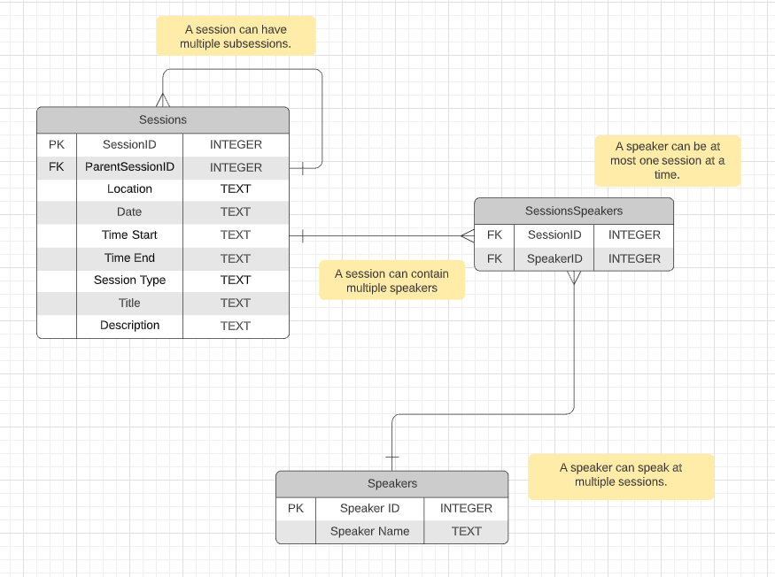

# Data Ingestion Challenge
This take home challenge features two python scripts that read in a spreadsheet containing sessions data of an event. One creates a database and populates its tables with the data extracted from the spreadsheet. The other allows a user to query data using a lookup value.

&nbsp;

Technologies used include:
- **xlrd**: a library for reading and formatting information from Excel files in the historical .xls format.
- **sqlite3**: a module that provides a SQL interface for the SQLite library

# Database Schema
The original diagram can be found at: https://lucid.app/lucidchart/3361b75a-01e5-463e-8d10-3af31460101e/edit?invitationId=inv_aefdb851-a1d3-4df7-b3a7-056ab0d5715b 

Note: you will need to make a Lucidchart account to view the schema.

&nbsp;

&nbsp;

# How to Use

To run this application, you will need python downloaded. You can install python here: https://www.python.org/downloads/

&nbsp;

Then install the required packages using 

    $ pip install -r requirements.txt

If you are using linux, change the file permissions of the program using chmod:

    $ chmod +x import_agenda.py lookup_agenda.py test_lookup_agenda.py

First use **import_agenda.py** to create the database and its tables.

In your terminal, run the command:

    $ ./import_agenda.py agenda.xls

Next, use **lookup_agenda.py** to search for a specific value in a column name. Once the query is done executing. Your results will be printed to the screen. Execution of this script uses the following format:

    $ ./lookup_agenda.py column value

The accepted column names are
- date
- time_start
- time_end
- title
- location
- description
- speaker

For values that have multiple words. Surround the query with quotation marks.

    ./lookup_agenda.py speaker "Yuanyuan Zhou"
    
    ./lookup_agenda.py location "South Pacific Ballroom"

Please note that searches are case-sensitive and lookup values have to match exactly. 

# Link to Libraries/Modules

sqlite3: https://docs.python.org/3/library/sqlite3.html

xlrd: https://xlrd.readthedocs.io/en/latest/